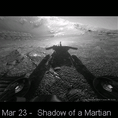

# Astro

Astronomy Picture of the Day — displays NASA's daily space images directly from the APOD archive on a 240x240 display.

## Preview



## Features

- Fetches images directly from apod.nasa.gov (no API key needed)
- Routes images through wsrv.nl proxy for resizing and baseline JPEG conversion
- Auto-scales images to fit the 240x240 display
- Shows image title and date as an overlay at the bottom
- Cycles through the last 30 days of images, one per minute
- Automatically skips video-only days and non-JPEG images

## Configuration

No configuration needed. The app parses HTML from NASA's APOD website to extract image URLs and titles. Images are resized via the wsrv.nl proxy to fit in memory.

## Dependencies

```
bodmer/TFT_eSPI@^2.5.0
kublet/KGFX@^0.0.22
kublet/OTAServer@^1.0.4
Bodmer/TJpg_Decoder@^1.1.0
```

## Build & Deploy

```bash
./tools/dev build astro       # Compile
./tools/dev deploy astro      # OTA deploy to device
./tools/dev init              # First-time USB flash + WiFi setup
./tools/dev logs              # Stream serial output
```

## Button

Press the button to skip to the next (older) image.
