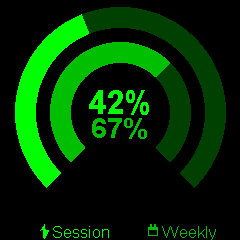

# Claude Usage

Displays Claude Code session and weekly usage as circular gauge visualizations with a green Matrix-style theme.

## Preview



## Features

- Two concentric ring gauges showing session and weekly usage percentages
- Lightning bolt icon for session usage, calendar icon for weekly usage
- Colors shift to red when usage exceeds 90%
- Auto-refreshes every 5 minutes

## Configuration

Requires a `server_url` configured during `./tools/dev init`. The server must expose an HTTP endpoint returning JSON in this format:

```json
{
  "session": { "percent": 45 },
  "weekly": { "percent": 62 }
}
```

The URL is stored in NVS preferences and auto-detected from your local IP during init (e.g. `http://192.168.1.100:8198`).

## Dependencies

```
bodmer/TFT_eSPI@^2.5.0
kublet/KGFX@^0.0.22
kublet/OTAServer@^1.0.4
bblanchon/ArduinoJson@^7.1.0
```

## Build & Deploy

```bash
./tools/dev build claude-usage       # Compile
./tools/dev deploy claude-usage      # OTA deploy to device
./tools/dev init                     # First-time USB flash + WiFi setup
./tools/dev logs                     # Stream serial output
```

## Button

No button interaction.
