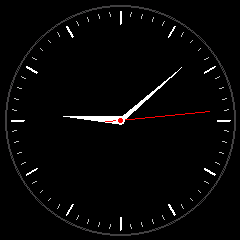

# Clock

Analog clock face with hour markers, minute ticks, and smooth-moving hands. Time is synced via NTP.

## Preview



## Features

- Classic analog clock with 12 hour markers and 60 minute ticks
- Smooth hour, minute, and red second hand with tail
- Precomputed sin/cos lookup tables for efficient rendering
- NTP resync every 15 minutes
- Optimized partial redraw (only updates when seconds change)

## Configuration

The timezone is hardcoded as US Eastern (`EST5EDT`). To change it, edit the `TIMEZONE` define in `src/main.cpp`:

```cpp
#define TIMEZONE "EST5EDT,M3.2.0,M11.1.0"
```

NTP servers: `pool.ntp.org`, `time.google.com`

## Dependencies

```
bodmer/TFT_eSPI@^2.5.0
kublet/KGFX@^0.0.22
kublet/OTAServer@^1.0.4
```

## Build & Deploy

```bash
./tools/dev build clock       # Compile
./tools/dev deploy clock      # OTA deploy to device
./tools/dev init              # First-time USB flash + WiFi setup
./tools/dev logs              # Stream serial output
```

## Button

Button is wired but not currently used.
