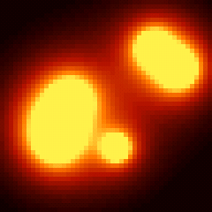

# Lava

Animated lava lamp simulation using metaball physics. Six blobs bounce, merge, and separate with gravity and damping for organic motion.

## Preview



## Features

- 6 metaballs rendered on a 48x48 grid, scaled 5x to fill the 240x240 display
- Smooth color interpolation based on metaball influence
- Gravity and damping for realistic blob movement
- 4 color palettes:
  1. Classic lava (red/orange/yellow/white)
  2. Blue lava (deep blue/cyan/light blue/white)
  3. Green slime (dark green/lime/yellow/white)
  4. Purple plasma (dark purple/magenta/pink/white)

## Configuration

No external configuration required.

## Dependencies

```
bodmer/TFT_eSPI@^2.5.0
kublet/KGFX@^0.0.22
kublet/OTAServer@^1.0.4
```

## Build & Deploy

```bash
./tools/dev build lava       # Compile
./tools/dev deploy lava      # OTA deploy to device
./tools/dev init             # First-time USB flash + WiFi setup
./tools/dev logs             # Stream serial output
```

## Button

Press the button to cycle through the 4 color palettes.
