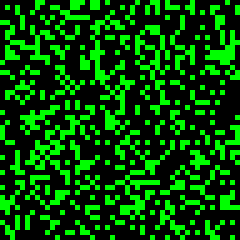

# Game of Life

Conway's Game of Life running on a toroidal grid. Mesmerizing to watch on a desk.

## Preview



## Features

- 48x48 cell grid on the 240x240 display (5px per cell)
- Classic Conway rules: birth with 3 neighbors, survival with 2 or 3
- Toroidal wrapping (edges connect to opposite sides)
- Fade effect: dying cells briefly glow dim green before disappearing
- Only redraws changed cells for smooth performance
- Auto-detects stagnation and re-seeds after 50 unchanged generations
- Auto-restarts when all cells die
- ~30% random fill density for interesting emergent patterns

## Configuration

No external configuration required.

## Dependencies

```
bodmer/TFT_eSPI@^2.5.0
kublet/KGFX@^0.0.22
kublet/OTAServer@^1.0.4
```

## Build & Deploy

```bash
./tools/dev build life       # Compile
./tools/dev deploy life      # OTA deploy to device
./tools/dev init             # First-time USB flash + WiFi setup
./tools/dev logs             # Stream serial output
```

## Button

Press the button to randomize the board with a fresh seed.
