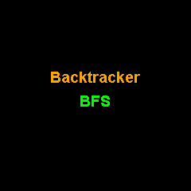

# Maze

Animated maze generation and solving visualizer. Watches algorithms build a maze, then solve it step by step.

## Preview



## Features

- 23x23 cell maze on the 240x240 display
- 4 generation algorithms: DFS (recursive backtracker), Prim's, Binary Tree, Sidewinder
- 5 solving algorithms: BFS, DFS, A*, Wall Follower (right-hand rule), Dijkstra's
- Color-coded visualization: orange cursor during generation, blue exploration, green solution path
- Animated phases with pauses between generation, solving, and solution tracing
- 20 total algorithm combinations (4 generators x 5 solvers)

## Configuration

No external configuration required.

## Dependencies

```
bodmer/TFT_eSPI@^2.5.0
kublet/KGFX@^0.0.22
kublet/OTAServer@^1.0.4
```

## Build & Deploy

```bash
./tools/dev build maze       # Compile
./tools/dev deploy maze      # OTA deploy to device
./tools/dev init             # First-time USB flash + WiFi setup
./tools/dev logs             # Stream serial output
```

## Button

Press the button to cycle through generation and solver algorithm combinations.
