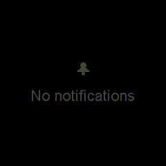

# Notice

Displays push notifications from your Mac on the Kublet in real-time. Captures notifications from all apps — iMessage, Slack, Discord, email, calendar, and more — by reading the macOS Notification Center database.

## Preview



## Features

- Real-time push notifications from **all macOS apps**
- Styled icons and colors for iMessage, Slack, Discord, Mail, Calendar, Chrome, FaceTime, Wallet, and Notes
- Modern card UI with message bubbles and accent stripes
- Auto-scrolling for long messages
- Stores last 10 notifications with button cycling
- Automatic message expiry after 30 minutes
- Emoji-to-text-art conversion for common emojis
- Device self-registers with the server on boot

## Architecture

```
macOS Notification Center DB ──> Python server ──POST /notify──> ESP32 web server
```

The server monitors `~/Library/Group Containers/group.com.apple.usernoted/db2/db` using `log stream` for instant detection, then reads the database for notification content. The ESP32 runs a web server endpoint that receives pushed notifications.

## Configuration

Requires the backend server running on your Mac and a `server_url` configured during `./tools/dev init`.

### Backend Server

Start the server:

```bash
./server/run
```

The server runs on port 8198 by default and exposes:

- `GET /api/notice/register?ip=X` — device self-registration
- `GET /api/notice/push?source=X&sender=X&text=X` — manual test push

### macOS Permissions

Requires **Full Disk Access** for your terminal (System Settings > Privacy & Security > Full Disk Access) to read the notification center database.

## Supported Sources

| Source | Icon | Color |
|---|---|---|
| iMessage | Speech bubble | Blue |
| Slack | Hash # | Yellow-orange |
| Discord | Bot face | Blurple |
| Mail | Envelope | Blue |
| Calendar | Calendar | Red |
| Chrome | Globe | Google blue |
| FaceTime | Phone | Green |
| Wallet | Card | Orange |
| Notes | Document | Yellow |
| Other apps | Bell | Gray |

## Dependencies

```
bodmer/TFT_eSPI@^2.5.0
kublet/KGFX@^0.0.22
kublet/OTAServer@^1.0.4
bblanchon/ArduinoJson@^7.1.0
```

## Build & Deploy

```bash
./tools/dev build notice       # Compile
./tools/dev deploy notice      # OTA deploy to device
./tools/dev init               # First-time USB flash + WiFi setup
./tools/dev logs               # Stream serial output
```

## Testing

Push test notifications via the server:

```bash
curl "http://localhost:8198/api/notice/push?source=imessage&sender=Alice&text=Hello+world"
```

Or directly to the device:

```bash
curl -X POST http://esp32.local/notify \
  -H "Content-Type: application/json" \
  -d '{"source":"imessage","sender":"Alice","text":"Hello world!"}'
```

## Button

Press the button to cycle through stored notifications.
