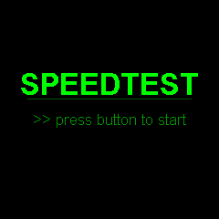

# Speed

Internet speed test using Cloudflare's speed test infrastructure. Measures ping, download, and upload with animated gauge visualizations.

## Preview



## Features

- Ping test: 5 iterations to Cloudflare, drops worst result
- Download test: multiple file sizes (500KB, 1MB, 2MB)
- Upload test: multiple file sizes (250KB, 500KB, 1MB, 2MB)
- Real-time arc gauge during each test phase
- Final results screen showing ping (ms), download (Mbps), upload (Mbps)
- Hacker-themed green aesthetic
- Gauge max: 3 Mbps (typical ESP32 WiFi throughput)

## Configuration

No external configuration required. Tests run against `speed.cloudflare.com`.

## Dependencies

```
bodmer/TFT_eSPI@^2.5.0
kublet/KGFX@^0.0.22
kublet/OTAServer@^1.0.4
```

## Build & Deploy

```bash
./tools/dev build speed       # Compile
./tools/dev deploy speed      # OTA deploy to device
./tools/dev init              # First-time USB flash + WiFi setup
./tools/dev logs              # Stream serial output
```

## Button

Press the button to start a new speed test.
