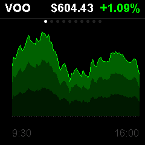

# Stock

S&P 500 and crypto intraday price charts using Yahoo Finance. Displays 10 tickers with color-coded gain/loss indicators.

## Preview



## Features

- 10-ticker watchlist: VOO, VGT, VTI, VXUS, AAPL, NVDA, GOOG, AMZN, ^VIX, BTC-USD
- Intraday line chart with gradient-filled area (green for gains, red for losses)
- Up to 78 data points per ticker at 5-minute intervals
- Percentage change display
- Time labels on x-axis
- Auto-refreshes every 5 minutes
- All tickers cached locally for instant switching
- Detects market hours; crypto tickers show 24/7

## Configuration

The timezone is set to US Eastern for market hour detection. Data is fetched directly from the Yahoo Finance API — no server or API key needed.

To modify the watchlist, edit the `tickers` array in `src/main.cpp`.

## Dependencies

```
bodmer/TFT_eSPI@^2.5.0
kublet/KGFX@^0.0.22
kublet/OTAServer@^1.0.4
bblanchon/ArduinoJson@^7.1.0
```

## Build & Deploy

```bash
./tools/dev build stock       # Compile
./tools/dev deploy stock      # OTA deploy to device
./tools/dev init              # First-time USB flash + WiFi setup
./tools/dev logs              # Stream serial output
```

## Button

Press the button to cycle through the 10 tickers.
