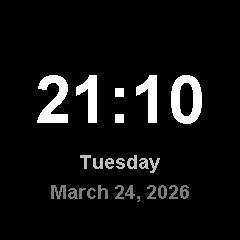

# Time

Simple digital clock displaying time, day of week, and full date. Syncs via NTP.

## Preview



## Features

- Large centered HH:MM time display (white)
- Day of week (cyan) and full date (gray)
- NTP resync every 15 minutes
- Efficient rendering: only redraws when values change

## Configuration

The timezone defaults to US Eastern. To change it, edit the POSIX timezone string in `src/main.cpp`:

```cpp
#define POSIX_TZ "EST5EDT,M3.2.0,M11.1.0"
```

Common alternatives (provided as comments in source):

| Timezone | POSIX String |
|----------|-------------|
| US Central | `CST6CDT,M3.2.0,M11.1.0` |
| US Pacific | `PST8PDT,M3.2.0,M11.1.0` |
| Central Europe | `CET-1CEST,M3.5.0,M10.5.0/3` |
| UTC | `UTC0` |

## Dependencies

```
bodmer/TFT_eSPI@^2.5.0
kublet/KGFX@^0.0.22
kublet/OTAServer@^1.0.4
```

## Build & Deploy

```bash
./tools/dev build time       # Compile
./tools/dev deploy time      # OTA deploy to device
./tools/dev init             # First-time USB flash + WiFi setup
./tools/dev logs             # Stream serial output
```

## Button

Button is wired but not currently used.
