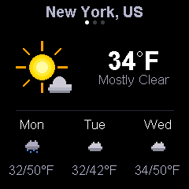

# Weather

Current weather and 3-day forecast using the Open-Meteo API. Displays animated pixel art weather icons, temperature, and conditions on a 240x240 display.

## Preview



## Features

- Current weather with large animated icon, temperature, and condition label
- 3-day forecast with small icons, day names, and high/low temps
- 10 weather icon types: clear, mostly clear, partly cloudy, cloudy, fog, drizzle, rain, freezing rain, snow, thunderstorm
- Animated icons: pulsing sun rays, drifting clouds, falling rain/snow, flickering lightning, sliding fog
- 3 locations: New York, Stockholm, Los Angeles
- Location indicator dots below city name
- Auto-refreshes every 15 minutes
- All temperatures in Fahrenheit

## Configuration

To modify locations, edit the `locations` array in `src/main.cpp`. Each entry has a display name, latitude, and longitude. Weather data is fetched directly from the Open-Meteo API (HTTP, no API key needed).

## Dependencies

```
bodmer/TFT_eSPI@^2.5.0
kublet/KGFX@^0.0.22
kublet/OTAServer@^1.0.4
bblanchon/ArduinoJson@^7.1.0
```

## Build & Deploy

```bash
./tools/dev build weather       # Compile
./tools/dev deploy weather      # OTA deploy to device
./tools/dev init                # First-time USB flash + WiFi setup
./tools/dev logs                # Stream serial output
```

## Button

Press the button to cycle through locations and force a weather refresh.
